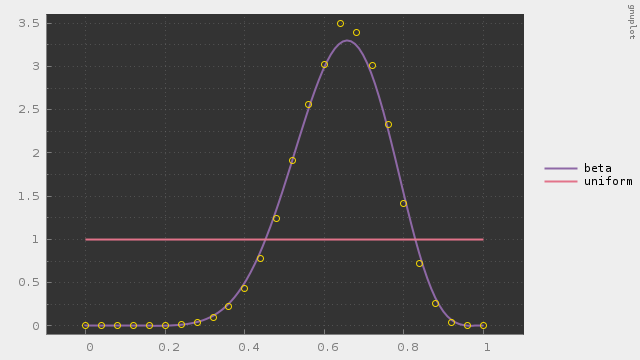

# metropolis-hastings

Markov chain Monte Carlo methods (Metropolis-Hastings)

---

#### これは何？

MCMCのMetropolis-Hastings法のC++によるフルスクラッチです。

事後分布からパラメタの推定値を求める際にd次元の数値積分が必要になる場合があります。しかし、それを直接に計算することはできないので、事後分布に従う乱数列を発生させるということを考えます。ここで2点問題があります。1つ目は、確率分布が評価できたとしても、その分布に従う乱数を発生させることは容易ではないという点です。2つ目は、事後分布の正規化定数にはd次元の積分が含まれているので、確率密度を計算することができないという点です。事後分布の正規化定数には触らず、事後分布のカーネルだけを用いて事後分布に従う乱数列を発生させるにはどうしたらよいのかという問題に対して、MCMC法を用いることができます。MCMCは、事後分布のカーネルと、乱数発生が容易な提案分布とを利用して、事後分布に従う乱数列を発生させる手法です。

##### 動作サンプル

ガウス分布を提案分布、ガンマ分布を目標分布とした例です。

一様分布を提案分布、ベータ分布を目標分布とした例です。

